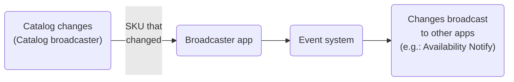

# Broadcaster

The Broadcaster app is designed to adapt catalog broadcaster changes to an event in VTEX IO's Events system.

Typically, it's used when developing another IO app that receives the events and calls handler functions to treat the events. For more details about this use, see the [Receiving Catalog Changes on VTEX IO](https://developers.vtex.com/docs/guides/how-to-receive-catalog-changes-on-vtex-io) guide.

For example, the [Availability Notify](https://developers.vtex.com/vtex-developer-docs/docs/vtex-availability-notify) app uses the Broadcaster app to monitor inventory updates. Once the requested SKU is back in stock, the app will email shoppers who asked to be notified.

The Broadcaster app receives a POST request from the catalog broadcaster with the details of the SKU that changed and pushes an event to the Event system to broadcast to apps that listen to these changes.

> ⚠️ The Broadcaster app receives catalog changes from the same account where the app is installed and not from sellers.

## SKU information

When the Broadcaster app sends an event, it contains a payload with the following fields:

| Field name                                | Description                                                                                                                                                                                                                                                                                                                                                                                                                                                                                                                            | Type    |
| ----------------------------------------- | -------------------------------------------------------------------------------------------------------------------------------------------------------------------------------------------------------------------------------------------------------------------------------------------------------------------------------------------------------------------------------------------------------------------------------------------------------------------------------------------------------------------------------------- | ------- |
| `IdSku`                                   | SKU ID on VTEX.                                                                                                                                                                                                                                                                                                                                                                                                                                                                                                        | string  |
| `ProductId`                               | Product ID on VTEX. This field is optional and is only sent in marketplace contexts when an event occurs in the affiliate catalog.                                                                                                                                                                                                                                                                                                                                                                     | long    |
| `An`                                      | Account name on VTEX, shown in the store’s VTEX Admin URL.                                                                                                                                                                                                                                                                                                                                                                                                                                                             | string  |
| `IdAffiliate`                             | ID code of the affiliate that generated the event. This field is optional and is only sent in marketplace contexts when an event occurs in the affiliate catalog.                                                                                                                                                                                                                                                                                                                                      | string  |
| `SellerChain`                             | Sellers involved in the chain. This field is optional and is only sent in marketplace contexts with [Multilevel Omnichannel Inventory](https://help.vtex.com/en/tutorial/multilevel-omnichannel-inventory--7M1xyCZWUyCB7PcjNtOyw4) when an event occurs in the affiliate catalog. When there is more than one seller in the chain, they're all included in this field separated by a forward slash (`/`). Example: `"cea/rihappy"`. | string  |
| `DateModified`                            | Date when the item was updated.                                                                                                                                                                                                                                                                                                                                                                                                                                                                                        | string  |
| `IsActive`                                | Identifies whether the product is active or not. If `true`, the product/SKU is active.                                                                                                                                                                                                                                                                                                                                                                                                                 | boolean |
| `StockModified`                           | Indicates that the inventory level has changed. If `false`, the inventory level hasn't changed.                                                                                                                                                                                                                                                                                                                                                                                                        | boolean |
| `PriceModified`                           | Indicates that the price has changed. If `false`, the product/SKU price hasn't changed.                                                                                                                                                                                                                                                                                                                                                                                                                | boolean |
| `HasStockKeepingUnitModified`             | Indicates that the product/SKU details have changed, such as name, description, weight, etc. If `true`, the product/SKU details have changed.                                                                                                                                                                                                                                                                                                                                                          | boolean |
| `HasStockKeepingUnitRemovedFromAffiliate` | Indicates that the product is no longer associated with the trade policy. If `true`, the trade policy has changed.                                                                                                                                                                                                                                                                                                                                                                                     | boolean |

## Notifications in subaccounts

When attempting to listen for catalog change notifications in a [subaccount](https://help.vtex.com/en/tutorial/creating-subaccount-multi-store-multi-domain--tutorials_510), you'll likely find that your app isn't receiving notifications. This is because, by default, catalog change notifications are only sent to the Broadcaster app installed in the main account.

### "Notify Subaccounts" setting

The Broadcaster app installed in the main (parent) account can be configured to push a notification event to all associated subaccounts.

To configure this setting, follow the steps below:

1. Go to **My Apps** in the VTEX Admin.
2. In the list of installed apps, search for **Broadcaster**.
3. Click `Settings` in the app box.
4. Check the `Notify Subaccounts` box.
5. Click `Save`.

## Testing the app

By default, when the Broadcaster Adapter app sends events, they're only sent in the master workspace of each account. If you work in a **[development workspace](https://developers.vtex.com/vtex-developer-docs/docs/vtex-io-documentation-workspace)**, there's a way to receive events there:

### "Notify Target Workspace" setting

The app installed in the master workspace can be configured to push a notification event to a selected target workspace in addition to the master workspace.

To configure this setting, follow the steps below:

1. Go to **My Apps** in the VTEX Admin.
2. In the list of installed apps, search for **Broadcaster**.
3. Click `Settings`.
4. Enter the name of the workspace you want to notify in the **Notify Target Workspace** field.
5. Click `Save`.
