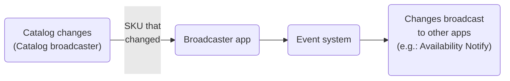

# Broadcaster

The Broadcaster app is designed to adapt catalog broadcaster changes to an event in IO's Events system.

Typically, the Broadcaster app is aimed at developing another IO app that receives the events and calls handler functions to treat the events. For more details about this scenario, see the [Receiving Catalog Changes on VTEX IO](https://developers.vtex.com/docs/guides/how-to-receive-catalog-changes-on-vtex-io) guide.

For example, the [Availability Notify](https://developers.vtex.com/vtex-developer-docs/docs/vtex-availability-notify) app uses the Broadcaster app to monitor inventory updates. Once the requested SKU gets back in stock, the app will email shoppers who asked to be notified.

The Broadcaster app receives a POST request from the catalog broadcaster with the data of the SKU that changed, and then it pushes an event to the Event system to broadcast to apps that will listen to these changes.

> ⚠️ The Broadcaster app receives catalog changes from the same account where the app is installed and not from sellers.

## SKU data

When the Broadcaster app sends an event, it contains a payload with the following fields.

| Field Name | Description | Type |
| - | - | - |
| `IdSku` | SKU ID on VTEX. | string |
| `ProductId`| Product ID on VTEX. | long |
| `An`| Account Name on VTEX, shown in the store’s VTEX Admin URL. | string |
| `IdAffiliate` | Affiliate ID generated automatically in the configuration. | string |
| `DateModified` | Date when the item was updated. | string |
| `IsActive` | Identifies whether the product is active or not. If `true` the product/SKU is active. | boolean |
| `StockModified` | Identifies that the inventory level has been changed. If `false`, the inventory level has not been changed. | boolean |
| `PriceModified` | Identifies that the price has been changed. If `false`, the product/SKU price has not been changed. | boolean |
| `HasStockKeepingUnitModified` | Identifies that the product/SKU details have changed, such as name, description, weight, etc. If `true`, the product/SKU details changed. | boolean |
| `HasStockKeepingUnitRemovedFromAffiliate` | Identifies that the product is no longer associated with the trade policy. If `true`, the trade policy has changed. | boolean |

## Notifications in franchise accounts

When attempting to listen for catalog change notifications in a [subaccount](https://help.vtex.com/en/tutorial/creating-subaccount-multi-store-multi-domain--tutorials_510), you will likely find that your app is not receiving notifications. This is because, by default, catalog change notifications are only sent to the Broadcaster app installed in the main account.

### "Notify Subaccounts" setting

The Broadcaster app installed in the main (parent) account can be configured to push a notification event to all associated subaccounts.

To perform this setting, follow these steps:

1. Go to **My Apps** in the VTEX Admin.
2. In the list of installed apps, search for **Broadcaster**.
3. Click `Settings` in the app box.
4. Activate the checkbox to `Notify Subaccounts`.
5. Click `Save`.

## Testing the app

By default, when the Broadcaster Adapter app sends events, these events are only sent in each account's master workspace. If you work in a **[Development workspace](https://developers.vtex.com/vtex-developer-docs/docs/vtex-io-documentation-workspace)**, there are two ways to receive events there:

### "Notify Target Workspace" setting

The app installed in the master workspace can be configured to push a notification event to a target workspace of your choice in addition to the master workspace.

To configure this setting, follow these steps:

1. Go to **My Apps** in the VTEX Admin
2. In the list of installed apps, search for **Broadcaster**.
3. Click `Settings`.
4. Enter the name of the workspace you wish to notify in the **Notify Target Workspace** field.
5. Click `Save`.
